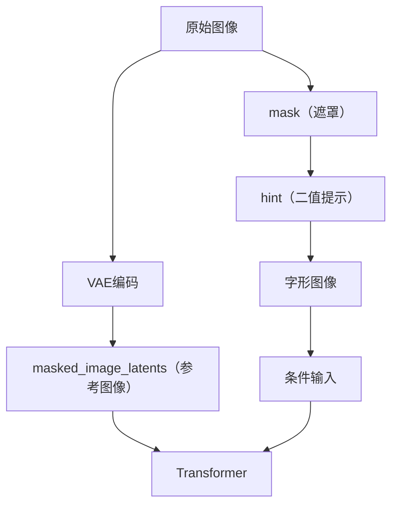

[FluxText](https://arxiv.org/pdf/2505.03329) 是最新的中文文本编辑生成方案。本文详细梳理其执行流程，便于后续查阅和理解。

<!--more-->

## 流程总览

FluxText 执行流程主要包括以下几个阶段：

1. **预处理阶段**：生成 mask（遮罩）和字形图像
2. **文本编码**：使用 CLIP 和 T5 对文本进行编码
3. **条件图像编码**：通过 VAE 对条件图像进行编码
4. **扩散生成**：Transformer 处理，生成最终图像

下图展示了主要数据流向：



---

## 1. 预处理阶段：Mask 和字形生成

### 1.1 术语解释

- **mask**：遮罩，标记需要编辑的区域
- **hint**：提示信息，用于指示文字位置的二值数组
- **contours**：轮廓，OpenCV 中检测到的图像边界
- **glyphs**：字形图像，待写入汉字的二值图

### 1.2 主要流程

以 `anyword-3M` 数据集为例，数据中包含每段文字的矩形框坐标。预处理阶段会：

- 根据矩形框生成 mask
- 由 mask 得到 hint
- 在 mask 区域生成待写入汉字的字形图像

#### 关键代码及注释

```python
# 以下代码的作用是根据 mask 找到最大轮廓，并在该位置生成字形图像
def get_glyph_pos(mask, text, width, height):
    # 确保遮罩是单通道的
    if len(mask.shape) == 3:
        mask = mask[:, :, 0]
    mask = mask.astype('uint8')
    contours, _ = cv2.findContours(mask, cv2.RETR_EXTERNAL, cv2.CHAIN_APPROX_SIMPLE)
    hint = mask / 255
    glyph_scale = 1

    if len(contours) > 0:
        # 找到最大的轮廓
        largest_contour = max(contours, key=cv2.contourArea)
        rect = cv2.minAreaRect(largest_contour)
        w, h = rect[1]
        # 检查轮廓是否足够大，避免字体过小
        if w >= 20 and h >= 20:
            glyphs = draw_glyph2(selffont, text, largest_contour, scale=glyph_scale, width=width, height=height)
        else:
            # 轮廓太小，创建最小尺寸的矩形轮廓，保证后续处理稳定
            center_x, center_y = int(width/2), int(height/2)
            min_size = 50
            min_contour = np.array([
                [center_x - min_size//2, center_y - min_size//2],
                [center_x + min_size//2, center_y - min_size//2],
                [center_x + min_size//2, center_y + min_size//2],
                [center_x - min_size//2, center_y + min_size//2]
            ], dtype=np.int32)
            glyphs = draw_glyph2(selffont, text, min_contour, scale=glyph_scale, width=width, height=height)
    else:
        # 没有找到轮廓，创建默认中心矩形轮廓
        center_x, center_y = int(width/2), int(height/2)
        default_size = 100
        default_contour = np.array([
            [center_x - default_size//2, center_y - default_size//2],
            [center_x + default_size//2, center_y - default_size//2],
            [center_x + default_size//2, center_y + default_size//2],
            [center_x - default_size//2, center_y + default_size//2]
        ], dtype=np.int32)
        glyphs = draw_glyph2(selffont, text, default_contour, scale=glyph_scale, width=width, height=height)
    return hint, glyphs
# 输出：hint（位置提示）和 glyphs（字形图像）
```

**设计说明**：  
当轮廓太小时，采用最小矩形轮廓，保证后续字体生成不会出错。这种设计提升了算法的健壮性。

### 1.3 变量澄清

- `condition_img` 在文中有嵌套结构：外层为条件图像数组，内层为要写入的汉字图像。

---

## 2. 文本编码处理

### 2.1 术语解释

- **prompt**：输入文本提示
- **CLIP**：用于图文对齐的编码器
- **T5**：文本编码器
- **prompt_embeds**：T5 编码后的特征，shape 为 `[1, 512, 4096]`，512 是 T5 编码器设置的最大序列长度
- **pooled_prompt_embeds**：CLIP 编码后的特征，shape 为 `[1, 768]`
- **text_ids**：T5 返回的位置编码，shape 为 `[512, 3]`

### 2.2 主要流程

- prompt 经过 CLIP 和 T5 编码，分别得到 pooled_prompt_embeds 和 prompt_embeds
- prompt_embeds 的 shape 为 `[1, 512, 4096]`，512 是 T5 最大序列长度
- pooled_prompt_embeds 的 shape 为 `[1, 768]`
- text_ids 的 shape 为 `[512, 3]`，与图像位置编码对齐

---

## 3. 条件图像编码

### 3.1 术语解释

- **VAE**：变分自编码器，用于图像特征提取
- **latents**：潜在表示，VAE 编码后的特征
- **condition_latents**：条件图像的 VAE 编码
- **condition_type_ids**：条件类型编码，类似 BERT 的 segment_id

### 3.2 主要流程

- 条件图像（含字形、hint、原图）通过 VAE 编码，得到 condition_latents
- condition_type_ids 标记条件类型（如 word_fill、depth 等）

---

## 4. 扩散生成阶段

### 4.1 术语解释

- **masked_image**：移除待填充区域后的原始图像
- **masked_image_latents**：masked_image 的 VAE 编码
- **conditon_masked_images_latents**：与条件图像尺寸对齐的 masked_image 编码
- **mask_image**：mask 的二值图
- **mask**：编码后的 mask，提供位置信息

### 4.2 主要流程

- 原始图像去除待填充区域，得到 masked_image
- masked_image 和 mask 分别编码，拼接后作为参考图像输入
- mask 也作为条件输入，与 conditon_masked_images_latents 合并
- 通过 Transformer 进行去噪和生成

---

## 5. 参数说明表

| 参数名                    | 说明                         | shape 示例           |
|--------------------------|------------------------------|---------------------|
| prompt_embeds            | T5 编码特征                  | [1, 512, 4096]      |
| pooled_prompt_embeds      | CLIP 编码特征                | [1, 768]            |
| text_ids                 | T5 位置编码                  | [512, 3]            |
| latents                  | 初始噪声潜在表示             | [1, 1024, 64]       |
| condition_latents        | 条件图像 VAE 编码            | [1, 1024, 384]      |
| masked_image_latents     | 参考图像编码                 | [1, 1024, 64]       |
| mask                     | mask 编码                    | [1, 64, H, W]       |

---

## 6. 错误处理说明

- 当检测到的轮廓过小时，自动生成最小矩形轮廓，防止字体大小为 0 或后续处理出错。
- 若未检测到轮廓，则生成默认中心矩形，保证流程稳定。

---

## 7. 总结

FluxText 通过多模态编码（文本、图像、mask、字形等）和条件扩散生成，实现了高质量的中文文本编辑。其核心机制包括：

- 多路输入（文本、图像、mask、字形）协同驱动扩散过程
- 关键参数 shape 设计合理，便于特征对齐
- 错误处理机制提升了系统健壮性

该流程为中文文本编辑任务提供了强大且灵活的技术支持。

---

如有进一步建议，欢迎交流！


